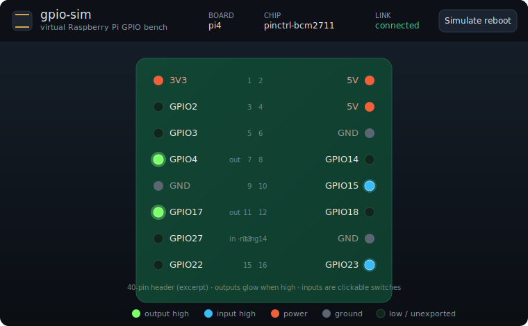

# docker-rpi-simulator

**A Dockerized, language-agnostic Raspberry Pi GPIO simulator.** It emulates the Linux
**sysfs** GPIO interface (`/sys/class/gpio/…`) entirely in userspace with FUSE, so GPIO
code written in *any* language — as long as it talks to sysfs — runs unchanged with **no
Raspberry Pi and no real hardware**. Comes with a web panel to watch output pins and click
input pins, and runnable examples in five languages.

[](https://github.com/arsa-dev/docker-rpi-simulator/actions/workflows/ci.yml)
[](LICENSE)
[](https://github.com/arsa-dev/docker-rpi-simulator/pkgs/container/docker-rpi-simulator)



> **Who this is for:** people learning Raspberry Pi / embedded GPIO without hardware, and
> developers who want to run or CI-test sysfs-based GPIO apps off-device (Linux or macOS).

---

## Quickstart

You need Docker. On macOS, Docker Desktop works out of the box.

```sh
git clone https://github.com/arsa-dev/docker-rpi-simulator
cd docker-rpi-simulator
docker compose up
```

Open **http://localhost:8080** — that's the panel. Now, in a second terminal, blink an LED
and watch it flash on GPIO17:

```sh
docker exec gpio-sim sh -c '
  echo 17 > /sys/class/gpio/export
  echo out > /sys/class/gpio/gpio17/direction
  while true; do echo 1 > /sys/class/gpio/gpio17/value; sleep .3;
                 echo 0 > /sys/class/gpio/gpio17/value; sleep .3; done'
```

Export GPIO27 as an input and **click it on the panel** — or drive it from the API:

```sh
curl -X POST -d '{"level":1}' http://localhost:8080/api/pin/27
```

That's the whole idea: the CLI, a library, and a panel click all move the *same* pin.

### Without compose

```sh
docker run --rm -it -p 8080:8080 \
  --device /dev/fuse --cap-add SYS_ADMIN --security-opt apparmor=unconfined \
  ghcr.io/arsa-dev/docker-rpi-simulator
```

---

## What works — and what doesn't

This simulates the **sysfs** interface (`/sys/class/gpio`). Any code that uses sysfs works,
in **any language**. Verified with real libraries and hand-written I/O — see [`examples/`](examples/).

| ✅ Works (uses sysfs) | ❌ Not supported (bypasses sysfs) |
|---|---|
| Shell `echo` into `/sys/class/gpio` | **RPi.GPIO** — pokes SoC registers via `/dev/gpiomem` |
| Node.js **`onoff`** | **WiringPi** — also `/dev/gpiomem` |
| Python file I/O / **python-periphery** (sysfs mode) | **libgpiod** / `gpioset` / `gpioget` — character device `/dev/gpiochipN` |
| C/Go with `poll`/`epoll`/`select` | modern **gpiozero** (chardev backend) |

The character-device (`/dev/gpiochipN`) and I²C (`/dev/i2c-N`) interfaces are a different
kernel mechanism and are on the [roadmap](#roadmap) as separate modules. We deliberately
**do not** claim RPi.GPIO support, because it never touches sysfs.

---

## The web panel

A faithful 40-pin Raspberry Pi header. **Output** pins are driven by your code and **glow
when high** — you watch them. **Input** pins are yours to operate: click (or press
<kbd>Space</kbd>) to toggle, and a matching `edge` wakes a program blocked in `poll()`.
Power/GND pins are inert; unexported pins are dim. It updates live over WebSocket from
*any* source, is keyboard-accessible, and is fully self-contained (no CDN/fonts).

### Control API

| Method & path | Body | Does |
|---|---|---|
| `GET /api/state` | — | full snapshot: board, chip, every pin |
| `POST /api/pin/{n}` | `{"level":0\|1}` | drive input pin `n` (409 if it's an output) |
| `POST /api/reboot` | — | reset all pins to power-on defaults |
| `GET /ws` (WebSocket) | — | pushes the state snapshot on every change |

---

## Configuration

All via environment variables (see [`docker-compose.yml`](docker-compose.yml)):

| Variable | Default | Meaning |
|---|---|---|
| `GPIO_BOARD` | `classic` | board preset: `classic` (bcm2835), `pi4` (bcm2711), `pi5` (rp1) |
| `GPIO_MOUNT_MODE` | `auto` | `auto` → canonical, else plain; or force `canonical` / `plain` |
| `GPIO_HTTP_PORT` | `8080` | web panel port |
| `GPIO_LOG_LEVEL` | `info` | `error` \| `warn` \| `info` \| `debug` |
| `GPIO_BASE` / `GPIO_NGPIO` / `GPIO_LABEL` | from preset | override the chip base / line count / label |

All presets keep `base=0` so sysfs `gpioN` == BCM `N` — the numbering every Pi tutorial
assumes, and what the panel's header labels line up with.

### The mounting problem, and the minimal privileges

In a plain container and on macOS Docker Desktop, `/sys/class/gpio` doesn't exist and
`/sys` is read-only. **canonical** mode makes it appear at the real path with a tmpfs
shadow of `/sys/class` (preserving the other entries), so unmodified libraries just work;
**plain** mode mounts at `/gpio` as a fallback. Either way the container needs only:

```
--device /dev/fuse --cap-add SYS_ADMIN --security-opt apparmor=unconfined
```

**Never `--privileged`.** `/dev/fuse` is the FUSE device; `SYS_ADMIN` is for the `mount`
syscalls; `apparmor=unconfined` lets those mounts through Docker's default profile. Details
in [ADR 0001](docs/adr/0001-architecture.md).

---

## Development

The core model is portable C and unit-tests anywhere (including macOS):

```sh
make test                                  # 61 native unit checks
./tests/integration/run_docker_it.sh       # core + web suites on real FUSE (Docker)
./tests/integration/run_docker_examples.sh  # all language examples end-to-end (Docker)
```

The daemon (`src/`) is one process: an authoritative in-memory **line model** with two
frontends onto it — the sysfs FUSE filesystem and the HTTP/WebSocket panel — so a CLI
write, a library call, and a panel click can never disagree. See
[ADR 0001](docs/adr/0001-architecture.md) for the architecture and the reasoning behind
C + libfuse3.

```
src/core/     the line model (single source of truth)
src/sysfs/    FUSE frontend — the poll/edge linchpin (.poll + fuse_notify_poll)
src/web/      HTTP + WebSocket panel & control API (no external deps)
src/control/  UNIX-socket control channel used by tests
web/          self-contained panel assets
examples/     runnable blink+button in 5 languages (double as integration tests)
docs/adr/     architecture decision records
```

---

## Roadmap

The model/frontend split is designed so these attach as sibling modules without reworking
the core:

- **Character device** (`/dev/gpiochipN`) for libgpiod / `gpioset` / modern gpiozero.
- **I²C** (`/dev/i2c-N`).

---

## License

[AGPL-3.0-or-later](LICENSE). Contributions welcome — see [CONTRIBUTING.md](CONTRIBUTING.md).
